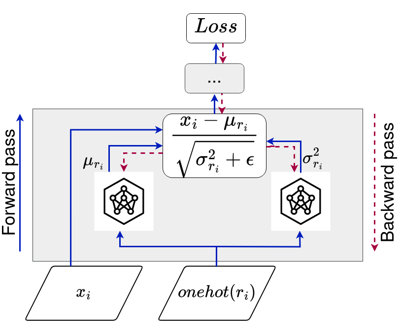

# <center>**Context Normalization**</center>

This repository is an official implementation and applications of CN: Context Normalization.

## Paper Submitted to EGC 2024. Bilal FAYE et al. (Best Paper Award): (Link)[https://editions-rnti.fr/?inprocid=1002907]


## Introduction

CN (Context Normalization) is a novel approach in neural networks that leverages context-based data grouping for faster convergence and superior performance, distinguishing itself from traditional methods like Batch Normalization and Mixture Normalization.


**Figure: Context Normalization Layer.**
<br>
<br>
<br>
<br>
<br>

**Abstract.** Deep neural networks face challenges with distribution shifts across layers, affecting model convergence and performance. While Batch Normalization (BN) addresses these issues, its reliance on a single Gaussian distribution assumption limits adaptability. To overcome this, alternatives like Layer Normalization, Group Normalization, and Mixture Normalization emerged, yet struggle with dynamic activation distributions. We propose "Context Normalization" (CN), introducing contexts constructed from domain knowledge. CN normalizes data within the same context, enabling local representation. During backpropagation, CN learns normalized parameters and model weights for each context, ensuring efficient convergence and superior performance compared to BN and MN. This approach emphasizes context utilization, offering a fresh perspective on activation normalization in neural networks.

## Applications

CN (Context Normalization) can be used as a layer, it is compatible with any neural network architecture, and can be applied at any network level (ref. normalization directory).


We offer the full version of CN version available in the "normalization" directory.

In this repository, we provide four experiments with CN on classification and domain adaptation tasks using Vision Transformer (ViT) and Convolutional Neural Network (CNN) architectures:

* A Comparative Study using Shallow Neural Network: Context Normalization vs.
Mixture Normalization with GMM Components as Contexts (ref. mn_bn_cn_comparison directory).

* A comparative Study using Deep Neural Network: Context Normalization vs. Mixture Normalization with GMM components as Contexts using DenseNet-40 and DenseNet-100 architecture (ref. cn_densenet)

* Using Superclasses as Contexts in Context Normalization<br>
    * Using CIFAR-100 Superclasses as Contexts (ref. cn_cifar100 directory)<br>
    * Using Oxford-IIIT Superclasses as contexts (ref. cn_oxford directory)

* Domain Adaptation: Using Source and Target Domains as Contexts (ref. cn_adamatch directory)

The experiments conducted in this study utilize several commonly used benchmark datasets in the classification community, including:

<center>

| Dataset               | Link                                  
|-----------------------|---------------------------------------
| CIFAR-10              | [CIFAR-10 Link](https://www.cs.toronto.edu/~kriz/cifar.html)     |
| CIFAR-100             | [CIFAR-100 Link](https://www.cs.toronto.edu/~kriz/cifar.html)    
| Tiny ImageNet         | [Tiny ImageNet Link](https://www.kaggle.com/c/tiny-imagenet) 
| Oxford-IIIT Pet Dataset | [Pet Dataset Link](https://www.robots.ox.ac.uk/~vgg/data/pets/)  
| MNIST digits          | [MNIST Link](https://yann.lecun.com/exdb/mnist/)         
| SVHN                  | [SVHN Link](http://ufldl.stanford.edu/housenumbers/)         

</center>
<br>
<br>

## Results 
### <center> A Comparative Study Using Shallow Neural Network: Context Normalization vs. Mixture Normalization with GMM Components as Contexts. </center>

In this experiment, we use a shallow deep CNN in architectures in Mixture Normalization [paper](https://arxiv.org/abs/1806.02892).

**Evolution of accuracy (%) on CIFAR-10**
| Model      | Learning Rate | 25 Epochs | 50 Epochs | 75 Epochs | 100 Epochs |
|------------|---------------|-----------|-----------|-----------|------------|
| BN-1       | 0.001         | 84.34     | 86.49     | 86.41     | 86.90      |
| BN-2       | 0.005         | 83.44     | 84.39     | 85.65     | 85.65      |
| MN-1       | 0.001         | 84.45     | 86.60     | 86.6      | 87.07      |
| MN-2       | 0.005         | 83.47     | 84.60     | 85.68     | 85.80      |
| CN-1 | 0.001         | 85.9      | 86.93     | 87.09     | 87.11      |
| CN-2 | 0.005         | 83.65     | 85.09     | 86.28     | 86.41      |

**Evolution of accuracy (%) on CIFAR-100**
| Model      | Learning Rate | 25 Epochs | 50 Epochs | 75 Epochs | 100 Epochs |
|------------|---------------|-----------|-----------|-----------|------------|
| BN-1       | 0.001         | 57.41     | 59.74     | 59.82     | 59.82      |
| BN-2       | 0.005         | 55.64     | 56.97     | 56.29     | 56.29      |
| MN-1       | 0.001         | 56.90     | 59.80     | 59.80     | 60.10      |
| MN-2       | 0.005         | 55.80     | 55.80     | 56.56     | 57.09      |
| CN-1 | 0.001         | 57.74     | 61.01     | 61.01     | 61.01      |
| CN-2 | 0.005         | 55.47     | 57.06     | 57.06     | 57.60      |

**Evolution of accuracy (%) on Tiny ImaageNet**
| Model      | Learning Rate | 25 Epochs | 50 Epochs | 75 Epochs | 100 Epochs |
|------------|---------------|-----------|-----------|-----------|------------|
| BN-1       | 0.001         | 37.17     | 37.17     | 37.17     | 37.17      |
| BN-2       | 0.005         | 34.11     | 34.11     | 34.11     | 34.11      |
| MN-1       | 0.001         | 38.18     | 38.17     | 38.5      | 38.5       |
| MN-2       | 0.005         | 34.56     | 34.99     | 35.12     | 35.27      |
| CN-1 | 0.001         | 38.53     | 40.08     | 40.08     | 40.08      |
| CN-2 | 0.005         | 34.78     | 35.44     | 35.44     | 36.71      |

 on CIFAR-10, showing the formation and refinement of class-specific clusters over training epochs.")
**Figure: t-SNE visualization of activations in latent space after 25, 50, 70, and 100 training epochs. Context Normalization (CN) on CIFAR-10, showing the formation and refinement of class-specific clusters over training epochs.**
<br>
<br>
<br>
<br>
### <center> A Comparative Study Using Deep Neural Network: Context Normalization vs. Mixture Normalization with GMM Components as Contexts. </center>

In this experiment, we use a Deep CNN architectures: DenseNet-40 and DenseNet-100.<br>
<br>

 on CIFAR-10, showing the formation and refinement of class-specific clusters over training epochs.")
**Figure: The training/test error and cross-entropy loss are depicted for DenseNet with $40$ layers (DenseNet-40) and DenseNet with $100$ layers (DenseNet-100). Notably, the incorporation of CN significantly enhances the training process, expediting optimization. Concurrently, it demonstrates superior generalization, as evidenced by a consistently substantial margin compared to its batch normalized and mixture normalized counterparts in the error curve.**
<br>
<br>
<br>
<br>
<br>

### <center> Using CIFAR-100 Superclasses as Contexts </center>

In this experimental setup, we employ the Vision Transformer architecture as our foundational model [source](https://keras.io/examples/vision/image_classification_with_vision_transformer/), and we introduce CN as the initial layer within the model. For context, we utilize the superclass categorization of CIFAR-100.


| Model               | Accuracy | Precision | Recall | F1-Score |
|---------------------|----------|-----------|--------|----------|
| ViT+BN              | 55.63    | 8.96      | 90.09  | 54.24    |
| **ViT+CN**    | **65.87**    | **23.36** | **98.53**  | **65.69**    |

 on CIFAR-10, showing the formation and refinement of class-specific clusters over training epochs.")
**Figure: Comparing Training and Validation Error Curves: CN in ViT Architecture on CIFAR-100 show faster convergence and lower validation loss, enhancing learning efficiency and classification compared to BN..**
<br>
<br>
<br>
<br>
<br>


### <center> **Using Oxford-IIIT Superclasses as contexts** </center>

In this experiment, we employ a CNN architecture as the [baseline](https://github.com/mayur7garg/PetImageClassification/blob/master/Train.ipynb). We leverage the contexts of "Cat" and "Dog" superclasses and integrate CN before the prediction dense layer.

| Model                  | Epoch      | Accuracy  | Precision  | Recall  | F1-Score  |
|------------------------|------------|-----------|------------|---------|-----------|
| OxfordCNN base         | Epoch 80   | 63.12     | 50.23      | 80.11   | 69.23     |
|                        | Epoch 113  | 66.55     | 53.11      | 84.2    | 72.15     |
| OxfordCNN+CN     | Epoch 80   | 64.90     | 52.34      | 83.10   | 73.11     |
|                        | Epoch 113  | 67.52     | 55.12      | 86.13   | 75.90     |

<br>
<br>
<br>
<br>
<br>

### <center>**Domain Adaptation: Using Source and Target Domains as Contexts**</center>

To apply CN coherently, we implement unsupervised domain adaptation using [AdaMatch](https://keras.io/examples/vision/adamatch/). In this scenario, the source domain is MNIST, and the target domain is SVHN.

**MNIST (source domain)**
| Model                 | Accuracy  | Precision  | Recall  | F1-Score  |
|------------------------|-----------|------------|---------|-----------|
| AdaMatch              | 97.36     | 87.33      | 79.39   | 78.09     |
| AdaMatch+CN    | **99.26** | **99.20**  | **99.32** | **99.26** |


**SVHN (target domain)**
| Model                 | Accuracy  | Precision  | Recall  | F1-Score  |
|------------------------|-----------|------------|---------|-----------|
| AdaMatch              | 25.08     | 31.64      | 20.46   | 24.73     |
| AdaMatch+CN    | **43.10**     | **53.83**      | **43.10**   | **47.46**     |

<br>


 on CIFAR-10, showing the formation and refinement of class-specific clusters over training epochs.")

**Figure: Gradient Variance Evolution: AdaMatch+BN and AdaMatch+CN models during training on the source (MNIST) and target (SVHN) domains. Left: Max gradient variance per epoch. Right: Average gradient variance per epoch.**


```bash
@inproceedings{faye2024normalization,
  title={Context Normalization},
  author={Faye, Bilal and Azzag, Hanane and Lebbah, Mustapha and Fangchen, Fang},
  booktitle={Extraction et la Gestion des Connaissances (EGC)},
  year={2024}
}
```
